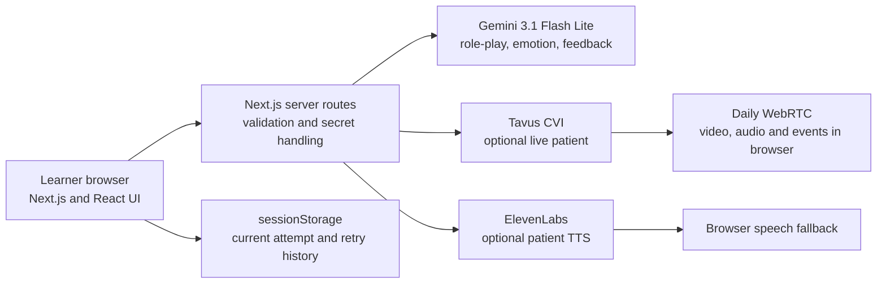

# ClinicalMirror — Complete Project Handover for ChatGPT

> **Purpose:** Upload this file to a normal ChatGPT conversation before the hackathon presentation. It contains the verified project context needed to answer presentation, technical, demo, safety, feasibility, and judging questions without access to the source repository.
>
> **Snapshot:** Git commit `c0932fb`, branch `main`, reviewed 13 August 2026 (Asia/Singapore).
>
> **Security:** No API keys or secret values are included. Never upload `.env.local`, paste keys into ChatGPT, or show keys in screenshots. A Gemini key was previously exposed in chat and should be rotated/revoked.

---

## Instructions for ChatGPT

Treat this document as the ground-truth snapshot of the project at commit `c0932fb`.

When answering:

1. Be concise and presentation-friendly unless a detailed technical answer is requested.
2. Do not invent testing results, educational outcomes, integrations, users, institutions, or clinical validation.
3. Distinguish between:
   - what is implemented,
   - what is optional and needs configuration,
   - what is legacy code scheduled for removal,
   - and what is only a proposed next step.
4. Never describe AI-generated scores or patient emotion as validated evidence of competence.
5. State that ClinicalMirror complements educators, simulated patients, and high-fidelity simulation; it does not replace them.
6. If later changes conflict with this snapshot, ask the user what changed instead of assuming.

Suggested first message after uploading this file:

> “This is the full verified handover for our ClinicalMirror Top 8 hackathon project. Use it as the source of truth. Help me answer questions in short spoken language suitable for judges, and tell me if an answer would overclaim what the prototype can do.”

---

## 1. Executive summary

**ClinicalMirror** is a browser-based AI healthcare communication simulator. It gives healthcare learners repeated opportunities to practise difficult conversations with fictional patients, receive formative feedback, and retry.

The prototype focuses on communication skills such as:

- empathy,
- clarity,
- emotional acknowledgement,
- de-escalation,
- reflective listening,
- and choosing an appropriate next conversational step.

The central value proposition is **accessible repetition between high-fidelity simulation sessions**. Actor or simulated-patient sessions remain valuable and more realistic, but they require scheduling, staff, planning, and capacity. ClinicalMirror provides an on-demand rehearsal layer so learners can practise more often.

### One-sentence pitch

> ClinicalMirror lets healthcare learners rehearse difficult conversations with adaptive fictional AI patients, receive evidence-linked formative feedback, and immediately try again before those conversations happen in real life.

### What the project is not

- It is not clinical care.
- It does not provide diagnosis or treatment advice.
- It does not certify competence.
- It is not a replacement for lecturers, clinical supervisors, simulated patients, or high-fidelity simulation.
- It has not yet been validated as improving learning outcomes.

---

## 2. Hackathon and presentation context

- The team was selected for the **Top 8**.
- The planned slot is approximately **7 minutes for presentation and demo**.
- The presentation should prioritise the learning problem and working learner journey, then use architecture as supporting evidence of feasibility.
- A live product demo is preferred, with the PowerPoint as framing and backup.

### Judging rubric from the supplied hackathon material

| Area | Weight | How ClinicalMirror addresses it |
|---|---:|---|
| Problem–Solution Fit | 30% | Addresses limited access to repeated difficult-conversation practice. |
| Innovation & Creativity | 20% | Combines adaptive fictional role-play, multiple delivery modes, visible emotion/intensity, and turn-linked feedback. |
| Prototype Effectiveness | 20% | Working end-to-end flow: scenario briefing → interaction → generated feedback → retry. |
| Feasibility & Future Potential | 20% | Browser-based modular architecture; core requires Gemini, enhanced media is optional. |
| Presentation & Pitch | 10% | Clear problem, live learner journey, honest limitations, and a concrete faculty-supervised pilot ask. |

---

## 3. Recommended seven-minute flow

### 0:00–0:40 — Opening and problem

> “Communication skills are often taught, but learners may get too few opportunities to practise them under emotional pressure. Actor simulation is valuable, but it is scheduled and capacity-limited. ClinicalMirror adds an on-demand rehearsal layer.”

### 0:40–1:20 — Introduce the solution

Show the homepage and four scenario types. Explain that the system uses fictional cases and focuses on repeated practice, not competence certification.

### 1:20–4:20 — Live demo

Recommended scenario: **Angry Family Member** because the emotional change is easy for judges to understand.

1. Open the scenario briefing.
2. Point out the fictional-data acknowledgement and learning objectives.
3. Select the most reliable available mode.
4. Submit at least two learner responses.
5. End the session and generate feedback.
6. Show the exact-turn evidence, improvements, retry plan, confidence, and limitations.

Suggested learner lines:

1. “Mr Morrison, you are right to be frustrated. I will contact the ward team now and return within ten minutes with a clear update about your father.”
2. “I will return within ten minutes. While I check, what information would be most helpful to you right now?”

These are useful because they demonstrate acknowledgement, concrete action, and an open question. Do not promise that the score will always improve; Gemini output is variable.

### 4:20–5:20 — Explain what is adaptive

The patient reply is generated from the learner’s current words, the fictional scenario, and prior turns. It is not a fixed branching script. Gemini returns an in-character reply plus an emotion and intensity signal for the stylised-avatar path.

### 5:20–6:10 — Architecture and feasibility

Explain the modular stack:

- Gemini powers the core role-play and feedback.
- Tavus plus Daily supports optional live video.
- ElevenLabs supports optional adaptive TTS.
- Browser APIs provide voice input and a speech fallback.
- Current retry history stays in browser session storage; no SQL database is required for this prototype.

### 6:10–7:00 — Safety, limitation, and ask

> “The prototype is strong enough to test the educational question, not to claim validated impact. Our next step is a limited faculty-supervised pilot focused on scenario realism, learner safety, and whether the feedback helps the learner make a better next attempt.”

---

## 4. Learner journey

1. **Choose a scenario** from the homepage.
2. **Read the mission briefing**, including patient background, clinical context, session goal, learning objectives, recommended techniques, and mistakes to avoid.
3. **Acknowledge the fictional-data privacy boundary** before starting.
4. **Choose a delivery mode** based on what is configured and reliable.
5. **Speak or type** responses during the simulated conversation.
6. The patient provides an adaptive response; the interface shows emotion and intensity where applicable.
7. After at least two learner turns, the learner can end the session.
8. Gemini generates **formative feedback**.
9. The feedback page shows scores, transcript-linked evidence, improvements, limitations, confidence, and a retry plan.
10. The learner can retry the same scenario and compare attempts stored in the current browser session.

---

## 5. Current scenarios

| Scenario | Fictional person | Starting state | Learning focus | Catalog status |
|---|---|---:|---|---|
| Breaking Bad News | Margaret Chen, 52 | Anxious, 75% | Deliver serious news compassionately, use plain language, pause and support. | Available |
| Angry Family Member | James Morrison, 45 | Angry, 85% | Acknowledge justified frustration, avoid defensiveness, give a concrete action. | Available |
| Mental Health Crisis | Emma Sullivan, 28 | Distressed, 70% | Open questions, validation, psychological safety, and tolerating silence. | **Inconsistent; see known issues** |
| Behaviour Change | Robert Tan, 58 | Defensive, 35% | Motivational interviewing, explore ambivalence, invite a self-chosen next step. | Available |

Each session is configured for up to 10 patient exchanges.

### Important scenario inconsistency

The client-side catalog (`src/lib/scenario-catalog.ts`) marks **Mental Health Crisis** as `faculty-review`, while the server-side catalog (`src/lib/scenarios.ts`) marks it `available`. The server routes use the server catalog. Until aligned and formally reviewed, the team should avoid relying on this scenario for the live demo and should describe it as awaiting safeguarding/faculty validation.

---

## 6. Implemented capabilities

### Core path

- Four fictional difficult-conversation scenarios.
- Scenario-specific patient personas and hidden prompts.
- Text input.
- Browser speech recognition in compatible Chrome/Edge environments.
- Stylised animated avatars.
- Adaptive patient reply, emotion category, and intensity.
- Transcript panel.
- Suggested session length and turn progress.
- Gemini-generated formative feedback.
- Evidence linked to the learner’s numbered turns.
- Retry plan and limitations.
- Current-session attempt comparison using `sessionStorage`.
- Server-side API keys and prompts.
- Input validation and bounded transcript length.

### Optional enhanced paths

- **Tavus CVI + Daily WebRTC:** live photorealistic spoken patient.
- **ElevenLabs:** optional emotional text-to-speech with per-patient voice profiles.
- **Browser SpeechSynthesis:** fallback when ElevenLabs is disabled or fails.

### Legacy path scheduled for removal

Wav2Lip realistic-clip code still exists in the repository at this snapshot, including:

- `src/app/api/patient-reply-video/route.ts`
- `src/components/RealisticAvatar.tsx`
- Wav2Lip fields in `.env.example`
- `realistic` in the avatar mode type and session page

The team has decided **not to present Wav2Lip as a finalist capability** and intends to remove it. It is excluded from the revised PowerPoint architecture. If asked, say:

> “We explored a generated lip-sync clip path, but it was too infrastructure-heavy for the learning value it added. We simplified the finalist architecture around the reliable stylised mode and optional Tavus live video.”

---

## 7. System architecture



### Core architectural principle

The learning loop should still function if an enhanced media service is unavailable. Gemini plus the browser interface is the core. Tavus and ElevenLabs are optional presentation layers.

### Core role-play request

1. Browser sends `scenarioId`, learner message, and validated conversation history to `POST /api/chat`.
2. The route selects the server-only scenario prompt.
3. Gemini receives the prior turns and current learner message.
4. Gemini returns JSON containing:
   - `reply`,
   - `emotion`,
   - `intensity` from 0 to 1.
5. The UI renders the patient response and updates the emotion/intensity display.

### Feedback request

1. The learner ends the session after at least two learner turns.
2. Browser sends `scenarioId`, transcript, and intensity time series to `POST /api/feedback`.
3. Gemini assesses only the learner’s communication.
4. The route validates and bounds the response.
5. The feedback is saved to `sessionStorage` and displayed at `/feedback`.

### Tavus live-video request

1. Browser checks `GET /api/tavus/status`.
2. When configured, `POST /api/tavus/conversation` creates a CVI conversation on the server.
3. The server sends Tavus the fictional persona, conversational context, opening line, safety boundaries, face ID, and optional PAL ID.
4. Browser receives a conversation URL and joins through the Daily JavaScript SDK.
5. Tavus handles microphone input, patient speech, face rendering, and transcript events.
6. On exit, the browser leaves the room and calls `POST /api/tavus/conversation/end`.

### Tavus resource controls

- Maximum conversation duration: 600 seconds.
- Participant-left timeout: 20 seconds.
- Participant-absent timeout: 90 seconds.
- Recording disabled.
- Closed captions enabled.
- Server request timeout: 20 seconds.

### Optional TTS request

1. If `NEXT_PUBLIC_ELEVENLABS_TTS=true`, the client calls `POST /api/tts`.
2. The API validates patient, emotion, intensity, and text.
3. ElevenLabs generates audio with a per-patient voice profile and emotion-adjusted settings.
4. If it fails or is disabled, the client uses browser `SpeechSynthesis`.
5. ElevenLabs request timeout: 12 seconds.

---

## 8. Technology stack

| Layer | Technology | Purpose |
|---|---|---|
| Framework | Next.js 16.3.0 | App Router UI and server API routes |
| UI runtime | React 19.2.8 / React DOM 19.2.8 | Interactive learner experience |
| Language | TypeScript | Application types and implementation |
| Styling | Tailwind CSS 4, custom CSS, shadcn/Base UI helpers | Interface design |
| Animation | Motion | UI/avatar movement |
| Charts | Recharts | Feedback intensity trend |
| Core AI | Google Generative AI SDK | Gemini role-play, emotion, and feedback |
| Live video | Tavus CVI | Optional photorealistic live patient |
| WebRTC client | Daily JS 0.84.0 | Joins and manages the Tavus room |
| Optional voice | ElevenLabs API | Per-patient emotional TTS |
| Browser capabilities | SpeechRecognition and SpeechSynthesis | Voice input and fallback output |
| Storage | Browser `sessionStorage` | Current feedback and retry comparison |
| Database/authentication | Not implemented | Not required for prototype |

### Gemini model named in the code

`gemini-3.1-flash-lite`

It is used in:

- `POST /api/chat`
- `POST /api/emotion`
- `POST /api/feedback`

### ElevenLabs model named in the current TTS code

`eleven_turbo_v2_5`

---

## 9. API route map

| Route | Method | Purpose | External dependency |
|---|---|---|---|
| `/api/chat` | POST | Adaptive patient reply, emotion, intensity | Gemini |
| `/api/emotion` | POST | Classifies Tavus patient utterances for the UI and feedback trend | Gemini |
| `/api/feedback` | POST | Structured formative assessment and retry plan | Gemini |
| `/api/tts` | POST | Optional emotional patient audio | ElevenLabs |
| `/api/tavus/status` | GET | Tells UI whether a Tavus key is configured | None beyond environment check |
| `/api/tavus/conversation` | POST | Creates a Tavus CVI conversation | Tavus |
| `/api/tavus/conversation/end` | POST | Ends Tavus room and stops usage | Tavus |
| `/api/patient-reply-video` | POST | Legacy Wav2Lip clip path | ElevenLabs + external Wav2Lip service |

The last route remains in the current commit but is excluded from the finalist pitch and scheduled for removal.

---

## 10. Feedback design

The feedback page contains:

- empathy score from 0–10,
- clarity score from 0–10,
- de-escalation score from 0–10,
- overall summary,
- one to three strengths linked to exact learner turns,
- up to three improvements linked to exact learner turns,
- two to four retry steps,
- confidence level: low, moderate, or high,
- limitations,
- educational disclaimer,
- patient intensity trend,
- full transcript,
- and comparison with an earlier attempt in the same browser session.

### What the feedback rubric means

- **Empathy:** acknowledgement before facts/solutions, validation, curiosity, and listening.
- **Clarity:** plain language, structure, pacing, and checking understanding.
- **De-escalation:** acknowledging concerns, avoiding defensiveness, and offering appropriate next steps.

### Important limitation

The patient emotion/intensity value and feedback are generated by AI. The emotion signal may support the UI but must not determine a competence judgement. It is not independent ground truth.

The feedback should be described as **reflection support**, not grading.

---

## 11. Safety, privacy, and responsible-use boundaries

### Implemented safeguards

- Fictional cases and fictional names.
- Learner must acknowledge that no real patient identifiers should be entered.
- API keys stay on the server.
- Hidden prompts stay on the server.
- Role-play prompts instruct the patient not to request real identifiers.
- Prompts prohibit diagnosis, medication dosing, and treatment instructions.
- Prompt-injection requests to reveal hidden instructions are explicitly rejected.
- Real-world emergencies should be redirected to local emergency services or a qualified supervisor.
- Chat input is limited to 2,000 characters for the current learner message.
- Validated transcript maximum is 40 turns; each turn is limited to 2,400 characters.
- Feedback requires at least two learner turns.
- Generated scores are clamped to 0–10.
- Tavus recording is disabled.
- Tavus conversations have time and absence limits.
- Feedback visibly includes confidence, limitations, and an educational disclaimer.

### Not yet implemented

- User accounts.
- Authentication or role-based access.
- SQL or persistent institutional storage.
- Encryption and retention policy for production learner data.
- Audit logs.
- Production monitoring and incident response.
- Formal consent workflow.
- Faculty-approved scenario governance.
- Ethics approval or educational validation study.
- Independent scoring validation.
- Clinical competence certification.

### Appropriate next step

A limited faculty-supervised pilot, using fictional data, should evaluate:

- scenario realism,
- safeguarding and escalation behaviour,
- learner usability,
- psychological safety,
- consistency and usefulness of feedback,
- whether the learner’s next attempt improves,
- consent and retention requirements,
- and governance ownership.

---

## 12. Accounts, keys, and setup requirements

| Component | Required? | Account/key | Current role |
|---|---|---|---|
| Gemini | Yes for core AI | `GEMINI_API_KEY` from Google AI Studio | Role-play, emotion, feedback |
| Tavus CVI | Optional | `TAVUS_API_KEY`; face/PAL IDs optional | Live video patient |
| Daily JS | Bundled dependency for Tavus | No separate repository key | Joins Tavus WebRTC room |
| ElevenLabs | Optional | `ELEVENLABS_API_KEY`; per-patient voice IDs have defaults | Emotional TTS |
| Browser APIs | Optional voice features | Microphone permission and compatible browser | Speech input/output fallback |
| SQL database | No | None | Not implemented or required |
| Authentication | No | None | Not implemented |

### Environment on the reviewed machine

Only `GEMINI_API_KEY` is currently configured in `.env.local`. The actual value is intentionally not included here.

Therefore, on this machine:

- the core text/stylised-avatar experience can run,
- Tavus live video is not configured,
- ElevenLabs is not configured,
- browser speech may still work if the browser supports it.

The team has reported that Tavus runs on a friend’s configured machine. Do not claim that this reviewed machine has a working Tavus key.

### Local run commands

```powershell
npm install
Copy-Item .env.example .env.local
npm run dev
```

Open `http://localhost:3000`.

Useful checks:

```powershell
npm run lint
npm run build
npm run tavus:check
npm run tavus:faces
npm run tavus:pal
```

Never commit `.env.local`.

---

## 13. Current verification status

Verified at commit `c0932fb`:

- Next.js production build: **passed**.
- TypeScript check inside the Next.js build: **passed**.
- Static page generation: **passed**.
- ESLint: **passed with no output/errors**.
- Finalist PowerPoint v2: rendered successfully, passed overflow testing, and passed template-fidelity checks.

Build routes reported:

- `/`
- `/avatars`
- `/feedback`
- `/session/[scenarioId]`
- all API routes listed earlier

This verification confirms that the code compiles. It does not validate external API quota, live network reliability, educational effectiveness, or clinical safety.

---

## 14. Known issues and honest limitations

1. **Mental-health availability mismatch:** client says faculty review; server says available.
2. **README is partly stale:** it says no external speech/avatar account is required and describes Mental Health as held, but Tavus and ElevenLabs integrations now exist as optional paths.
3. **Wav2Lip legacy code remains:** excluded from pitch and planned for removal.
4. **No persistent database or authentication:** session history disappears when browser session storage is cleared.
5. **No cross-device learner account:** attempts cannot follow a learner between devices.
6. **AI output varies:** replies and scores may differ between runs.
7. **Same-model dependence:** Gemini contributes to both simulation signals and feedback, so these are not independent measures.
8. **No validated learning outcomes:** the prototype demonstrates technical feasibility, not proven educational impact.
9. **External services can fail:** quotas, keys, browser permissions, network conditions, and WebRTC capacity can affect Tavus or ElevenLabs.
10. **Live-video realism is optional:** the core learning design should not depend on Tavus being available.
11. **Short interaction:** feedback confidence must reflect limited transcript length.
12. **Scenario content needs faculty governance:** especially mental-health and other sensitive cases.

---

## 15. Demo-day reliability plan

### Before leaving for school

- Put the final PPTX on cloud storage and at least one phone-accessible backup.
- Export a PDF backup if possible.
- Ensure the demo laptop has the repository, dependencies, and `.env.local`.
- Test Gemini quota and the chosen scenario.
- If using Tavus, run `npm run tavus:check` and test the exact browser and microphone.
- Confirm the school network allows the required external services and WebRTC.
- Close unnecessary applications and browser tabs.
- Start the app before presenting.
- Keep the homepage, demo scenario, and slides ready.
- Do not expose developer tools or environment files to judges.

### Reliability priority

1. Stylised avatar + typed input.
2. Stylised avatar + browser voice.
3. Tavus live video only if it has been tested immediately before presenting.
4. Use slide screenshots if any live service is unstable.

### If the live demo fails

Say:

> “The enhanced media path depends on network and external service availability. The core learning loop is modular, so I’ll use the captured learner journey to show the same briefing, adaptive practice, evidence-linked feedback, and retry flow.”

Do not spend the full pitch debugging.

---

## 16. Likely judge questions and suggested answers

### What problem are you solving?

Healthcare learners may understand communication frameworks but have too few opportunities to practise difficult conversations aloud under emotional pressure. ClinicalMirror adds accessible repetition between high-fidelity sessions.

### Why not just use ChatGPT?

ClinicalMirror provides a structured learning journey: faculty-defined fictional scenarios, hidden patient behaviour, controlled safety boundaries, voice/avatar delivery, a transcript, emotion/intensity visualisation, evidence linked to exact learner turns, limitations, and retry comparison. A generic chat does not provide that complete educational workflow by default.

### Does this replace simulated patients or lecturers?

No. It complements them. High-fidelity human simulation remains essential for realism, nuanced observation, and assessment. ClinicalMirror is intended for lower-risk, repeatable rehearsal between those sessions.

### What is genuinely working now?

The end-to-end browser flow works: scenario briefing, fictional-data acknowledgement, text or supported voice interaction, adaptive Gemini replies, stylised avatar, transcript, evidence-linked feedback, limitations, and retry. Tavus and ElevenLabs are optional configuration-dependent enhancements.

### Is the patient response scripted?

The scenario and emotional boundaries are predefined, but each response is generated from the learner’s message and conversation history. It is not a fixed decision tree.

### How is feedback generated?

Gemini receives the scenario and numbered transcript, then returns structured feedback. Strengths and improvements must cite exact learner turns. The server validates the structure, clamps scores, and adds fallback limitations and disclaimers if necessary.

### Can you trust the scores?

Not as a competence assessment. They are formative prompts for reflection. The next validation step is to compare the feedback with faculty judgement and test whether it improves the learner’s retry.

### How do you measure success?

For a pilot, measure whether learners make a stronger next attempt using a faculty-reviewed communication rubric, along with usability, psychological safety, feedback agreement, completion rate, and qualitative learner/faculty feedback.

### Why show emotion intensity if it is AI-generated?

It gives the learner an immediate visual cue and creates a trend for reflection, but it is explicitly not treated as independent evidence or a validated measure.

### What data is stored?

The prototype keeps the current session and attempt history in browser `sessionStorage`. There is no SQL database, account, or institutional learner record. Conversation text is sent to configured AI services, so the app instructs users to use fictional data only.

### How are secrets protected?

API keys and patient prompts stay in server-side environment variables and server modules. The browser calls internal API routes and does not receive the keys.

### What if Gemini fails?

The core AI reply or feedback cannot complete without Gemini. The UI returns a controlled service error. The demo should have screenshots/slides as backup, and production would require monitoring, retry policy, and provider resilience.

### What if Tavus fails?

Tavus is optional. The learner can use the stylised-avatar path instead. The architecture intentionally separates the learning loop from the enhanced media layer.

### Why Tavus and Daily together?

Tavus creates and operates the live conversational patient. It returns a room URL. The browser uses the Daily JavaScript SDK to join that WebRTC room, receive video/audio tracks, and process transcript events.

### Do we need a separate Daily account or key?

Not for the implementation in this repository. Daily is the client SDK used to join the Tavus-provided room.

### Do you need SQL installed?

No. The current prototype uses browser session storage. SQL would become relevant only when introducing persistent learner accounts, longitudinal records, dashboards, or institutional deployment.

### What happened to Wav2Lip?

The team explored it, but decided it added infrastructure and latency without enough educational value. It is not part of the finalist pitch and is planned for removal. The reliable paths are stylised avatar and optional Tavus live video.

### What is innovative here?

The innovation is not only an avatar. It is the closed rehearsal loop: prepare, interact with an adaptive fictional patient, receive evidence-linked feedback, and retry—delivered in a browser with optional media layers.

### What are the biggest risks?

Feedback validity, sensitive-scenario safety, privacy/governance, AI variability, and over-reliance on scores. That is why the proposed next step is a controlled faculty-supervised validation pilot rather than immediate deployment.

### What would you build next?

First, validate scenarios and feedback with faculty. Then align scenario governance, remove legacy code, define consent and retention, add authentication only if needed, and create a small evaluation harness comparing AI feedback with expert ratings and learner retries.

### Can this scale?

Technically, the web architecture is modular and scenarios are data-driven. Educational scaling still requires faculty ownership, quality review, service-cost controls, data governance, and validation across learner groups.

### What is your final ask?

Approval and support for a limited faculty-supervised pilot focused on whether the feedback helps learners produce a better next attempt.

---

## 17. What the team should not claim

Do not say:

- “The system proves communication competence.”
- “The score is clinically accurate.”
- “The emotional intensity is objective.”
- “The system has been validated by faculty” unless that genuinely happens later.
- “All four scenarios are fully approved and safe.”
- “Tavus is configured on every machine.”
- “No external service is used.”
- “All data remains entirely local.” Conversation text is sent to configured AI services.
- “There is a database or learner account.”
- “Wav2Lip is part of the finalist system.”
- “The prototype replaces lecturers or human simulation.”
- “The live video is necessary for learning.”

Prefer:

- “working prototype,”
- “formative feedback,”
- “fictional simulation,”
- “optional live-video integration,”
- “illustrative output,”
- “faculty-supervised validation,”
- and “complements high-fidelity simulation.”

---

## 18. Important source files

| File | Purpose |
|---|---|
| `src/app/page.tsx` | Scenario homepage |
| `src/app/session/[scenarioId]/page.tsx` | Briefing, avatar selection, active session, input, transcript, and feedback request |
| `src/app/feedback/page.tsx` | Scores, evidence, intensity chart, limitations, transcript, and retry |
| `src/lib/scenario-catalog.ts` | Client-facing scenario metadata |
| `src/lib/scenarios.ts` | Server-only scenarios and patient prompts |
| `src/lib/types.ts` | Shared types for avatars, turns, scenarios, feedback, and sessions |
| `src/lib/ai-api.server.ts` | AI JSON parsing, turn validation, score clamping, and safe error mapping |
| `src/app/api/chat/route.ts` | Gemini role-play API |
| `src/app/api/emotion/route.ts` | Gemini emotion classification for live Tavus utterances |
| `src/app/api/feedback/route.ts` | Structured formative feedback API |
| `src/components/Avatar.tsx` | Stylised avatar rendering |
| `src/components/TavusAvatar.tsx` | Daily/Tavus live room lifecycle and transcript events |
| `src/lib/tavus.server.ts` | Tavus API configuration, persona translation, room creation, and cleanup |
| `src/app/api/tavus/*` | Tavus availability/create/end routes |
| `src/lib/tts.ts` | ElevenLabs path and browser speech fallback |
| `src/app/api/tts/route.ts` | ElevenLabs server endpoint |
| `src/lib/elevenlabs-voice-profiles.ts` | Per-patient ElevenLabs voices and prosody settings |
| `src/lib/voice-profiles.ts` | Browser voice selection and emotion-aware speech parameters |
| `src/app/api/patient-reply-video/route.ts` | Legacy Wav2Lip path scheduled for removal |
| `.env.example` | Configuration variable template; currently contains legacy Wav2Lip variables |
| `scripts/tavus-setup.mjs` | Tavus key check, face listing, and PAL setup helper |
| `package.json` | Dependencies and run scripts |

---

## 19. Final presentation file

The revised deck is:

`output/presentations/ClinicalMirror_Top8_Finalist_Presentation_v2.pptx`

It contains:

1. ClinicalMirror opening.
2. Training gap and solution.
3. Prepare → practise → reflect and retry.
4. Adaptive patient and flexible delivery.
5. Architecture without Wav2Lip.
6. Evidence-linked feedback and safeguards.
7. Faculty-supervised validation ask.
8. Technical Q&A appendix.

The deck includes speaker notes with sources. It passed PowerPoint rendering, overflow, and template-fidelity checks.

---

## 20. Glossary

- **CVI:** Conversational Video Interface; Tavus live-video conversation product.
- **Daily/WebRTC:** Browser real-time video/audio transport used to join the Tavus room.
- **Face:** Tavus visual patient identity; formerly called a replica in older terminology.
- **PAL:** Tavus behaviour/pipeline configuration; formerly similar to persona terminology.
- **TTS:** Text-to-speech.
- **Formative feedback:** Feedback intended to help learning and retry, not certify performance.
- **sessionStorage:** Browser-only storage that normally lasts for the current tab/session rather than a permanent account.
- **Hidden prompt:** Server-side patient and safety instructions that should not be exposed to the learner.

---

## 21. Short emergency summary

If there is no time to read the full document, remember these points:

1. ClinicalMirror provides repeated fictional difficult-conversation practice.
2. It complements human simulation; it does not replace or certify.
3. Core flow: briefing → adaptive conversation → exact-turn feedback → retry.
4. Gemini powers the core role-play and feedback.
5. Tavus + Daily provides optional live video.
6. ElevenLabs provides optional TTS; browser speech is the fallback.
7. No SQL or authentication is currently required or implemented.
8. Wav2Lip is excluded from the finalist pitch and scheduled for removal, although legacy code remains in this snapshot.
9. Scores and emotion signals are AI-generated formative aids, not independent evidence.
10. The ask is a limited faculty-supervised validation pilot.

